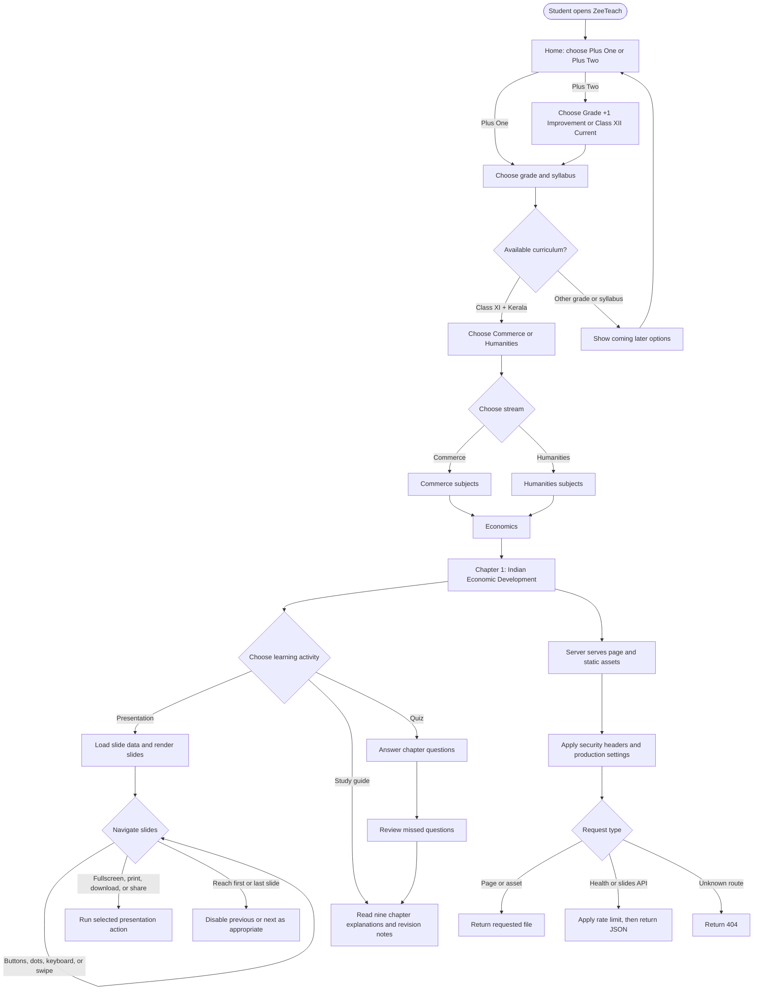

# ZeeTeach Program Flowchart

This chart maps the main student journey through the site, including the lesson tools available from the economics chapter page.

## Main program components

- `server.js` serves the pages, assets, downloads, health endpoint, and read-only slides API.
- `syllabus.js` and `streams.js` carry grade, syllabus, and track selections through navigation and disable unavailable options.
- `app.js` renders the economics presentation and handles slide navigation and actions.
- `study-guide.html` and `quiz.html` provide the reading and assessment paths.
- `flow.js` reads supported URL selections and applies them to the page navigation.
